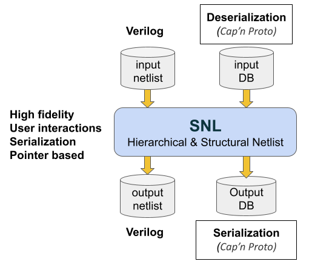

<div align="center">
<h1>Naja</h1>
</div>


[](https://app.codacy.com/gh/najaeda/naja?utm_source=github.com&utm_medium=referral&utm_content=najaeda/naja&utm_campaign=Badge_Grade_Settings)
[](https://codecov.io/gh/najaeda/naja)
[](https://opensource.org/licenses/Apache-2.0)

## Introduction
Naja is an Electronic Design Automation (EDA) project that provides open source data structures and APIs for the development of post logic synthesis EDA algorithms such as: netlist simplification (constant and dead logic propagation), logic replication, netlist partitioning, ASIC and FPGA place and route, …

Naja contains two main components SNL (Structured Netlist) API (located in this repo) and [naja-verilog](https://github.com/najaeda/naja-verilog), a data structure independent structural verilog parser.

In most EDA flows, data exchange is done by using standard netlist formats (Verilog, LEF/DEF, EDIF, …) which were not designed to represent data structures content with high fidelity. To address this problem, SNL relies on [Cap'n Proto](https://github.com/capnproto/capnproto) open source interchange format.

SNL also emphasizes EDA applications parallelization (targeting in particular cloud computing) by providing a robust object identification mechanism allowing to partition and merge data across the network.

SNL is summarized in below's image.



:information_desk_person: If you have any questions, please [Contact Us](mailto:christophe.alex@gmail.com)

:star: If you find Naja interesting, and would like to stay up-to-date, consider starring this repo to help spread the word.

### Acknowledgement

[](https://nlnet.nl/project/Naja)
[](https://nlnet.nl/project/Naja)

This project is supported and funded by NLNet through the [NGI0 Entrust](https://nlnet.nl/entrust) Fund.

## Compilation

### Getting sources

```bash
# First clone the repository and go inside it
git clone https://github.com/najaeda/naja.git
cd naja
git submodule init
git submodule update
```

### Dependencies

Mandatory dependencies:

1. Boost
2. [cmake](https://cmake.org): at least 3.22 version.
For system-specific cmake installation options, please refer to [this link](https://cmake.org/download/).
3. Python3: for building the SNL Python3 interface. This interface is used to load primitive cells (associated to Verilog parsing)
and their associated characteristics (for instance: ressource count, timing characteristics, ...).

Optional dependencies:

1. [Doxygen](https://www.doxygen.nl): for the documentation generation.

Embedded dependencies, through git sub modules:

1. [naja-verilog](https://github.com/najaeda/naja-verilog): for verilog parsing.
2. [google test](https://github.com/google/googletest) for unit testing.

On Ubuntu:

```bash
sudo apt-get install g++ libboost-dev python3.9-dev capnproto libcapnp-dev libtbb-dev pkg-config bison flex doxygen
```

Using [nix-shell](https://nixos.wiki/wiki/Development_environment_with_nix-shell):

```bash
nix-shell -p cmake boost python3 doxygen capnproto bison flex pkg-config tbb_2021_8
```

On macOS, using [Homebrew](https://brew.sh/):

```bash
brew install cmake doxygen capnp tbb bison flex
```

Ensure the versions of `bison` and `flex` installed via Homebrew take precedence over the macOS defaults by modifying your $PATH environment variable as follows:

```bash
export PATH="/opt/homebrew/opt/flex/bin:/opt/homebrew/opt/bison/bin:$PATH"
```

### Building and Installing

```bash
#First define an env variable that points to the directory where you want naja to be installed:
export NAJA_INSTALL=<path_to_installation_dir>
# Create a build dir and go inside it
mkdir build
cd build
cmake <path_to_naja_sources_dir> -DCMAKE_INSTALL_PREFIX=$NAJA_INSTALL
#For instance: cmake ~/srcs/naja -DCMAKE_INSTALL_PREFIX=$NAJA_INSTALL
make
make test
make install
```
### Building and Installing Documentation
```bash
#make sure that doxygen was available when launching the cmake command
cd build
make docs
make install
```
Documentation will be installed in $NAJA_INSTALL/doc directory. Starting file to open in browser is: $NAJA_INSTALL/doc/html/index.html.

## Use 
### Environment
After building and installing, start by setting up a runtime environment.
```bash
export NAJA_INSTALL=<path_to_installation_dir>
#For Naja python interface and in particular primitives loading
export PYTHONPATH=$PYTHONPATH:$NAJA_INSTALL/lib/python
```
### Inputs/Outputs
#### SNL Interchange Format
SNL relies on [Cap'n Proto](https://github.com/capnproto/capnproto) for data serialization and streaming. Schema files and C++ implementation can be found [here](https://github.com/najaeda/naja/tree/main/src/snl/snl/serialization/capnp).

Files composing the dump are created in a directory usually named "snl", composed of the following files:

- **Manifest File (`snl.mf`):** This file encapsulates essential meta-information such as the schema version and other relevant details.
- **Interface Definition File (`db_interface.snl`):** This file outlines the interfaces of modules: terminals and parameters.
- **Implementation Specification File (`db_implementation.snl`):** Contained within this file are the detailed implementations of modules: instances, nets and connectivity between them.

SNL files can be examined using the `capnp` tool.
```bash
capnp decode --packed snl_interface.capnp DBInterface < snl/db_interface.snl > interface.txt
capnp decode --packed snl_implementation.capnp DBImplementation < snl/db_implementation.snl > implementation.txt
```

#### Verilog

For Verilog parsing, Naja relies on naja-verilog submodule (https://github.com/najaeda/naja-verilog).
Leaf primitives are loaded through the Python primitive loader: [SNLPrimitivesLoader](https://github.com/najaeda/naja/blob/main/src/snl/python/primitives/SNLPrimitivesLoader.h).
A application snippet can be found [here](https://github.com/najaeda/naja/blob/main/src/snl/snippets/app/src/SNLVRLSnippet.cpp) and examples of
primitive libraries described using the Python interface can be found in the
[primitives](https://github.com/najaeda/naja/blob/main/primitives) directory.

A Verilog dumper is included in SNL API. See [here](https://github.com/najaeda/naja/blob/main/src/snl/formats/verilog/backend/SNLVRLDumper.h).

## Snippets
### c++
This [snippet](https://github.com/najaeda/naja/blob/main/src/snl/snippets/app/src/SNLSnippet.cpp) shows various SNL API netlist construction, manipulation and browsing examples.
### Python
This [snippet](https://github.com/najaeda/naja/blob/main/src/snl/snippets/python/snl_snippet.py) shows an equivalent example using Python interface.
### Application snippet
An application snippet can be found [here](https://github.com/najaeda/naja/blob/main/src/app_snippet).

This "app" directory and its contents can be copied to start a new application.

## Applications
###  naja_edit
`naja_edit`, accessible via the `$NAJA_INSTALL/bin` directory, is a tool designed for netlist translation and editing:

- **Format Translation**: convert netlists between SNL Interchange Format and Verilog.
```bash
#translation from verilog to SNL
naja_edit -f verilog -t snl -i input.v -o output.snl
```

- **Netlist Editing**: Utilize the SNL Python API for netlist editing.
```bash
#translation from verilog to SNL with intermediate editing
naja_edit -f verilog -t snl -i input.v -o output.snl -e script.py
```

`naja_edit` editing script examples are available [here](https://github.com/najaeda/naja/blob/main/src/apps/edit/examples).

## Issues / Bugs
Please use [GitHub Issues](https://github.com/najaeda/naja/issues) to create and track requests and bugs.
