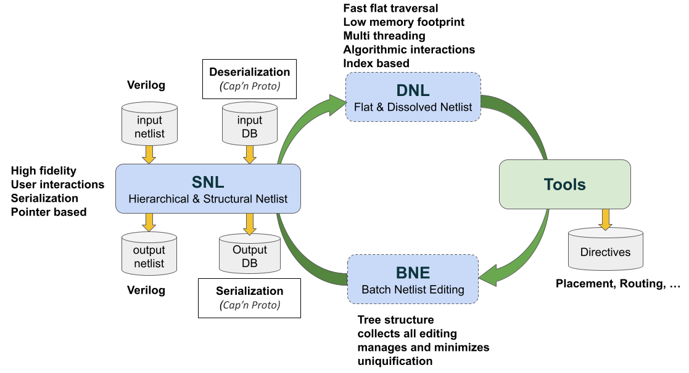

<div align="center">
<h1>Naja</h1>
</div>

[](https://pypi.org/project/najaeda)
[](
https://colab.research.google.com/github/najaeda/naja/blob/main/tutorials/notebooks/01_getting_started.ipynb)
[](https://matrix.to/#/#naja:fossi-chat.org)


[](https://codecov.io/gh/najaeda/naja)
[](https://opensource.org/licenses/Apache-2.0)
[](https://api.reuse.software/info/github.com/najaeda/naja)

## What is Naja?

Naja is an open source EDA framework for loading, elaborating, analyzing, optimizing, and transforming hardware designs from RTL SystemVerilog through structural netlists. It is usable from Python or C++.

- **SV/Verilog frontend** — parse Verilog and elaborate SystemVerilog RTL into a browsable design model
- **Netlist analysis** — hierarchy, connectivity, equipotentials
- **Logic optimization** — dead logic elimination, constant propagation
- **ECO transformations** — direct netlist editing
- **Serialization** — SNL interchange format (Cap'n Proto) and Verilog output



## Get Started

The best entry point is the [`najaeda`](https://pypi.org/project/najaeda/) Python package:

```bash
pip install najaeda
```

Full documentation: [najaeda.readthedocs.io](https://najaeda.readthedocs.io/en/latest/)

For AI-assisted design exploration, [`naja-scope`](https://github.com/najaeda/naja-scope)
is a najaeda-based MCP server that gives MCP-compatible assistants a precise,
structured view of elaborated SystemVerilog designs. Instead of pasting large
RTL files into chat, agents can ask targeted questions — what drives a signal,
what is inside a module, where a net comes from — and get small, exact answers
with file-and-line references.

### Tutorials

Six hands-on notebooks — open any of them in Colab with no local install needed:

| # | Topic | Colab |
| --- | --- | --- |
| 1 | Getting started — load Verilog, navigate hierarchy, visualize | [](https://colab.research.google.com/github/najaeda/naja/blob/main/tutorials/notebooks/01_getting_started.ipynb) |
| 2 | Liberty primitives — load a synthesised design with standard cells | [](https://colab.research.google.com/github/najaeda/naja/blob/main/tutorials/notebooks/02_liberty_primitives_design.ipynb) |
| 3 | Editing a netlist — rename, disconnect, reconnect, delete | [](https://colab.research.google.com/github/najaeda/naja/blob/main/tutorials/notebooks/03_editing_a_netlist.ipynb) |
| 4 | SystemVerilog elaboration — load and browse an elaborated SV design | [](https://colab.research.google.com/github/najaeda/naja/blob/main/tutorials/notebooks/04_systemverilog_elaborated_netlist.ipynb) |
| 5 | ibex RISC-V core — explore a real-world SV core, collect stats | [](https://colab.research.google.com/github/najaeda/naja/blob/main/tutorials/notebooks/05_ibex_riscv_core.ipynb) |
| 6 | Fanout analysis — compute fanout for every net, trace drivers, export to pandas | [](https://colab.research.google.com/github/najaeda/naja/blob/main/tutorials/notebooks/06_fanout_analysis.ipynb) |

## `naja_edit` — Netlist CLI

`naja_edit` is a command-line tool for optimizing and translating netlists.

:tv: Presented at [ORConf 2024](https://www.youtube.com/watch?v=JpwZGCuWekU).

```bash
# Translate Verilog → SNL
naja_edit -f verilog -t snl -i input.v -o output.snl

# Parse SystemVerilog with explicit top
naja_edit -f systemverilog -t verilog -i input.sv -o output.v --sv_top top

# Dead logic elimination
naja_edit -f snl -t snl -i input.snl -o output.snl -a dle

# Chain optimizations with Python scripts
naja_edit -f snl -t snl -i input.snl -o output.snl -a dle -e pre.py -z post.py
```

Available optimizations (`-a`): `all` (DLE + constant propagation + primitives), `dle`.

Python script examples: [src/apps/naja_edit/examples](https://github.com/najaeda/naja/blob/main/src/apps/naja_edit/examples)  
Regression suite: [naja-regress](https://github.com/najaeda/naja-regress)

## Building from Source

### Dependencies

**Ubuntu:**

```bash
sudo apt-get install g++ libboost-dev python3-dev capnproto libcapnp-dev libtbb-dev pkg-config bison flex
```

**macOS (Homebrew):**

```bash
brew install cmake capnp tbb bison flex boost
export PATH="/opt/homebrew/opt/flex/bin:/opt/homebrew/opt/bison/bin:$PATH"
```

**Nix:**

```bash
nix-shell -p cmake boost python3 capnproto bison flex pkg-config tbb_2021_8
```

### Build

```bash
git clone --recurse-submodules https://github.com/najaeda/naja.git
export NAJA_INSTALL=<install-dir>
mkdir build && cd build
cmake ../naja -DCMAKE_BUILD_TYPE=Release -DCMAKE_INSTALL_PREFIX=$NAJA_INSTALL
make && make test && make install
# Add to your environment after install:
export PYTHONPATH=$PYTHONPATH:$NAJA_INSTALL/lib/python
```

## C++ API

Naja exposes two complementary APIs:

- **SNL** (Structured Netlist) — full read/write netlist representation
- **DNL** (Dissolved Netlist) — fast, read-only flattened view for parallel analysis

Extended documentation: [naja.readthedocs.io](https://naja.readthedocs.io/en/latest/)  
C++ snippet: [NLUniverseSnippet.cpp](https://github.com/najaeda/naja/blob/main/src/app_snippet/src/NLUniverseSnippet.cpp)  
App template (copy to start a new tool): [src/app_snippet](https://github.com/najaeda/naja/blob/main/src/app_snippet)

## Community

- Chat: [Matrix #naja:fossi-chat.org](https://matrix.to/#/#naja:fossi-chat.org)
- Bugs / features: [GitHub Issues](https://github.com/najaeda/naja/issues)
- Contact: [contact@keplertech.io](mailto:contact@keplertech.io)

:star: If you find Naja useful, starring the repo helps spread the word.

## Acknowledgement

[](https://nlnet.nl/project/Naja)
[](https://nlnet.nl/project/Naja)

Supported by [NLNet](https://nlnet.nl/project/Naja) through the [NGI0 Entrust](https://nlnet.nl/entrust) Fund.
