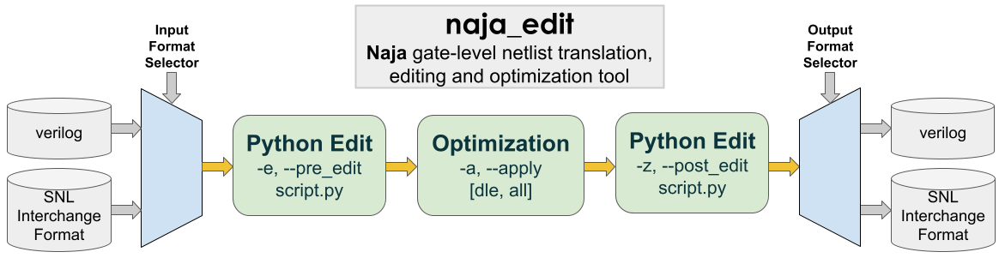

<div align="center">
<h1>Naja</h1>
</div>


[](https://app.codacy.com/gh/najaeda/naja?utm_source=github.com&utm_medium=referral&utm_content=najaeda/naja&utm_campaign=Badge_Grade_Settings)
[](https://codecov.io/gh/najaeda/naja)
[](https://opensource.org/licenses/Apache-2.0)
[](https://api.reuse.software/info/github.com/najaeda/naja)

## Introduction

Naja is an Electronic Design Automation (EDA) project that provides open source data structures and APIs for the development of post logic synthesis EDA algorithms such as: netlist simplification (constant and dead logic propagation), logic replication, netlist partitioning, ASIC and FPGA place and route, …

Naja best starting point is: [naja-edit](#naja_edit).


### Acknowledgement

[](https://nlnet.nl/project/Naja)
[](https://nlnet.nl/project/Naja)

This project is supported and funded by NLNet through the [NGI0 Entrust](https://nlnet.nl/entrust) Fund.

## naja_edit

`naja_edit`, located in the `$NAJA_INSTALL/bin` directory, is a tool designed for
optimizing, editing and translating netlists.

### Workflow Overview

The workflow for `naja_edit` is outlined in the schema below. It's important to note that the only mandatory step in the process is the initial loading of the input netlist.



### Workflow Details

- **Input/Output format**: Supports structural (gate-level) Verilog and [SNL Interchange Format](#snl-interchange-format).
Convert netlists between formats by specifying the input (`-f`) and output (`-t`) options.

```bash
#translation from verilog to SNL
naja_edit -f verilog -t snl -i input.v -o output.snl
```

- **Python Netlist Manipulation/Editing**: Leverage the [SNL Python API](#python)
for netlist manipulations such as browsing, computing stats or direct editing.
Scripts can be applied after loading (`-e` option) or before saving (`-z` option) the netlist.

```bash
#translation from verilog to SNL with intermediate editing
naja_edit -f verilog -t snl -i input.v -o output.snl -e script.py
```

- **Netlist Logic optimizations across hierarchy boundaries**: Utilize built-in
optimization algorithms to refine the netlist across hierarchical boundaries
with minimal uniquification. Available optimizations include:
    - All optimizations (option `-a all`): will apply Dead Logic Elimination (DLE), Constant Propagation and Primitives Optimization.
    - Dead Logic Elimination only (option `-a dle`): will apply only DLE.

```bash
# -1: Load input netlist from SNL format.
# -2: Apply pre_edit.py script on the netlist
# -3: Apply Dead Logic Optimization
# -4: Apply post_edit.py on the resulting netlist
# -5: Save netlist in SNL format to output.snl
naja_edit -f snl -t snl -i input.snl -o output.snl -a dle \ 
          -e pre_script.py -z post_edit.py
```

`naja_edit` editing script examples are available [here](https://github.com/najaeda/naja/blob/main/src/apps/edit/examples).

The [Naja Regress](https://github.com/najaeda/naja-regress) repository features a collection of examples
showcasing extensive use of `naja_edit`.

### Python API examples

```Python
from naja import snl 

def edit():
  universe = snl.SNLUniverse.get()
  top = universe.getTopDesign()

  #do something with top
```

#### Print all design content

```Python
from naja import snl 

def print_instance_tree(design):
  for ins in design.getInstances():
    print(ins.getName())
    model = ins.getModel()
    for term in design.getTerms():
      print(term)
    for net in design.getNets():
      print(net)
      for bit in net.getBits(): 
        for component in bit.getComponents():
          print(component) 
    print_instance_tree(model)

def edit():
  universe = snl.SNLUniverse.get()
  top = universe.getTopDesign()

  print_instance_tree(top)
```

<div align="right">[ <a href="#Introduction">↑ Back to top ↑</a> ]</div>

---

## Naja

Naja contains three primary API components:

1. SNL (Structured Netlist) API housed in this repository.
2. DNL (Dissolved Netlist) API associated to SNL also in this repository.
3. [naja-verilog](https://github.com/najaeda/naja-verilog), a data structure independent structural verilog parser.

### Why Naja ?

#### Enhanced Fidelity in Data Representation

In most EDA flows, data exchange is done by using standard netlist formats (Verilog, LEF/DEF, EDIF, …)
which were not designed to represent data structures content with high fidelity.
To address this problem, `SNL` relies
on [Cap'n Proto](https://github.com/capnproto/capnproto) open source interchange format.

`DNL` provides a uniquified view of `SNL`, specifically designed for efficient multi-threaded traversal
and analysis of netlist data.
Key features of `DNL` include:
- Read-only Data Structure: Ensures data integrity and stability during analysis.
- Fast Construction: `DNL` is quickly built from `SNL`, facilitating rapid transitions between representations.
- Index-based Minimal Details: Reduces overhead and focuses on essential connectivity information.
- Connectivity Representation: Utilizes equipotentials between terminals to represent connections effectively.

Together, `SNL` and `DNL` enhance the fidelity, performance, and efficiency of netlist data handling in EDA workflows.

#### Optimized for Parallelization and Cloud Computing

SNL is engineered with a focus on parallelization, particularly for cloud computing applications. It features a robust object identification mechanism that streamlines the partitioning and merging of data across networks, facilitating efficient EDA applications.

SNL is summarized in below's image.


:information_desk_person: If you have any questions, please [Contact Us](mailto:christophe.alex@gmail.com)

:star: If you find Naja interesting, and would like to stay up-to-date, consider starring this repo to help spread the word.

### Documentation

:eyeglasses: Naja's extended and API [documentation](https://naja.readthedocs.io/en/latest/) is available online.

### Compilation

#### Getting sources

```bash
# First clone the repository and go inside it
git clone --recurse-submodules https://github.com/najaeda/naja.git
```

#### Dependencies

Mandatory dependencies:

1. Boost
2. [cmake](https://cmake.org): at least 3.22 version.
For system-specific cmake installation options, please refer to [this link](https://cmake.org/download/).
3. Python3: for building the SNL Python3 interface. This interface is used to load primitive cells (associated to Verilog parsing)
and their associated characteristics (for instance: ressource count, timing characteristics, ...).

Optional dependencies:

1. [Doxygen](https://www.doxygen.nl): for the documentation generation.

Embedded dependencies, through git sub modules:

1. [naja-verilog](https://github.com/najaeda/naja-verilog): for verilog parsing.
2. [google test](https://github.com/google/googletest) for unit testing.

On Ubuntu:

```bash
sudo apt-get install g++ libboost-dev python3.9-dev capnproto libcapnp-dev libtbb-dev pkg-config bison flex doxygen
```

Using [nix-shell](https://nixos.wiki/wiki/Development_environment_with_nix-shell):

```bash
nix-shell -p cmake boost python3 doxygen capnproto bison flex pkg-config tbb_2021_8
```

On macOS, using [Homebrew](https://brew.sh/):

```bash
brew install cmake doxygen capnp tbb bison flex boost
```

Ensure the versions of `bison` and `flex` installed via Homebrew take precedence over the macOS defaults by modifying your $PATH environment variable as follows:

```bash
export PATH="/opt/homebrew/opt/flex/bin:/opt/homebrew/opt/bison/bin:$PATH"
```

#### Building and Installing

```bash
#First define an env variable that points to the directory where you want naja to be installed:
export NAJA_INSTALL=<path_to_installation_dir>
# Create a build dir and go inside it
mkdir build
cd build
cmake <path_to_naja_sources_dir> -DCMAKE_BUILD_TYPE=Release -DCMAKE_INSTALL_PREFIX=$NAJA_INSTALL
#For instance: cmake ~/srcs/naja -DCMAKE_BUILD_TYPE=Release -DCMAKE_INSTALL_PREFIX=$NAJA_INSTALL
make
make test
make install
```

#### Building and Installing Documentation

```bash
#make sure that doxygen was available when launching the cmake command
cd build
make docs
make install
```

Documentation will be installed in $NAJA_INSTALL/doc directory. Starting file to open in browser is: $NAJA_INSTALL/doc/html/index.html.

<div align="right">[ <a href="#Introduction">↑ Back to top ↑</a> ]</div>

---

### Use

#### Environment

After building and installing, start by setting up a runtime environment.

```bash
export NAJA_INSTALL=<path_to_installation_dir>
#For Naja python interface and in particular primitives loading
export PYTHONPATH=$PYTHONPATH:$NAJA_INSTALL/lib/python
```

#### Inputs/Outputs

##### SNL Interchange Format

SNL relies on [Cap'n Proto](https://github.com/capnproto/capnproto) for data serialization and streaming. Schema files and C++ implementation can be found [here](https://github.com/najaeda/naja/tree/main/src/snl/snl/serialization/capnp).

Files composing the dump are created in a directory usually named "snl", composed of the following files:

- **Manifest File (`snl.mf`):** This file encapsulates essential meta-information such as the schema version and other relevant details.
- **Interface Definition File (`db_interface.snl`):** This file outlines the interfaces of modules: terminals and parameters.
- **Implementation Specification File (`db_implementation.snl`):** Contained within this file are the detailed implementations of modules: instances, nets and connectivity between them.

SNL files can be examined using the `capnp` tool.

```bash
capnp decode --packed snl_interface.capnp DBInterface < snl/db_interface.snl > interface.txt
capnp decode --packed snl_implementation.capnp DBImplementation < snl/db_implementation.snl > implementation.txt
```

##### Verilog

For Verilog parsing, Naja relies on naja-verilog submodule (https://github.com/najaeda/naja-verilog).
Leaf primitives are loaded through the Python primitive loader: [SNLPrimitivesLoader](https://github.com/najaeda/naja/blob/main/src/snl/python/primitives/SNLPrimitivesLoader.h).
An application snippet can be found [here](https://github.com/najaeda/naja/blob/main/src/snl/snippets/app/src/SNLVRLSnippet.cpp) and examples of
primitive libraries described using the Python interface can be found in the
[primitives](https://github.com/najaeda/naja/blob/main/primitives) directory.

A Verilog dumper is included in SNL API. See [here](https://github.com/najaeda/naja/blob/main/src/snl/formats/verilog/backend/SNLVRLDumper.h).

<div align="right">[ <a href="#Introduction">↑ Back to top ↑</a> ]</div>

---

### Snippets

#### c++

This [snippet](https://github.com/najaeda/naja/blob/main/src/snl/snippets/app/src/SNLSnippet.cpp) shows various SNL API netlist construction, manipulation and browsing examples.

#### Python

This [snippet](https://github.com/najaeda/naja/blob/main/src/snl/snippets/python/snl_snippet.py) shows an equivalent example using Python interface.

#### Application snippet

An application snippet can be found [here](https://github.com/najaeda/naja/blob/main/src/app_snippet).

This "app" directory and its contents can be copied to start a new application.

<div align="right">[ <a href="#Introduction">↑ Back to top ↑</a> ]</div>

---

### Issues / Bugs

Please use [GitHub Issues](https://github.com/najaeda/naja/issues) to create and track requests and bugs.

<div align="right">[ <a href="#Introduction">↑ Back to top ↑</a> ]</div>
