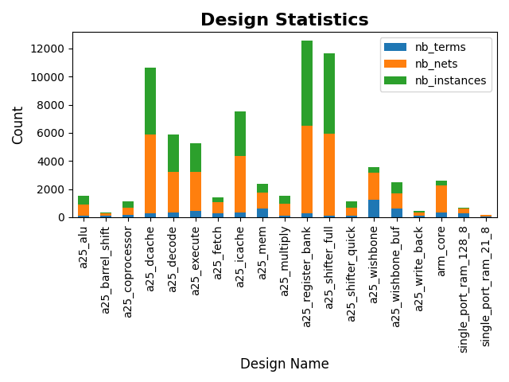
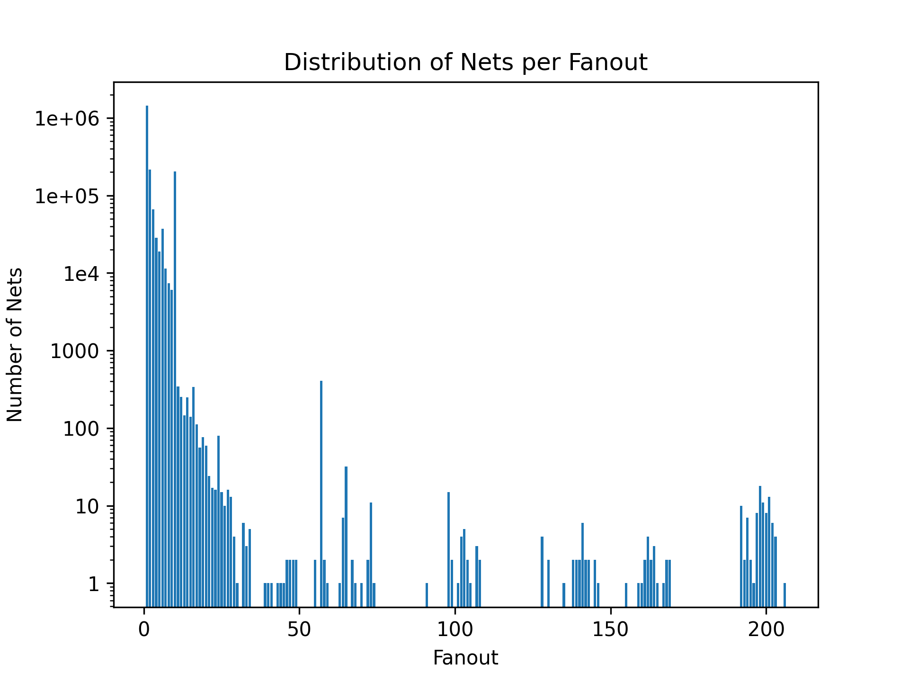

# Naja Python API Examples

The Naja Python API provides powerful tools for working with hierarchical netlists. It allows users to:

- **Browse netlist data**: Collect detailed information and navigate through design hierarchy seamlessly.
- **Apply ECO transformations**: Make engineering changes without disrupting the design's core structure.

To get started, create a Python script with an `edit` function. Here’s an example setup:

```python
from naja import snl

def edit():
    universe = snl.SNLUniverse.get()
    top = universe.getTopDesign()

    # Perform actions with the top-level design
```

---

## Examples

### 1. Print All Design Content

This script recursively explores the design hierarchy and prints information about instances, terminals, nets, and their connections.

```python
from naja import snl

def print_instance_tree(design):
    for ins in design.getInstances():
        print(f"Instance: {ins.getName()}")
        model = ins.getModel()
        for term in design.getTerms():
            print(f"  Terminal: {term}")
        for net in design.getNets():
            print(f"  Net: {net}")
            for bit in net.getBits():
                for component in bit.getComponents():
                    print(f"    Component: {component}")
        print_instance_tree(model)

def edit():
    universe = snl.SNLUniverse.get()
    top = universe.getTopDesign()

    print_instance_tree(top)
```

---

### 2. Remove Interface Buffers from an FPGA Design

The following script removes specific interface buffers (`IBUF`, `OBUF`, and `BUFG`) from an FPGA design.

```python
from naja import snl

def delete_io_bufs(design):
    for ins in design.getInstances():
        model = ins.getModel()
        if model.isPrimitive():
            model_name = model.getName()
            if model_name in ['IBUF', 'BUFG']:
                input_net = ins.getInstTerm(model.getScalarTerm('I')).getNet()
                output_net = ins.getInstTerm(model.getScalarTerm('O')).getNet()
                for component in output_net.getComponents():
                    component.setNet(input_net)
                output_net.destroy()
                ins.destroy()
            elif model_name == 'OBUF':
                input_net = ins.getInstTerm(model.getScalarTerm('I')).getNet()
                output_net = ins.getInstTerm(model.getScalarTerm('O')).getNet()
                for component in input_net.getComponents():
                    component.setNet(output_net)
                input_net.destroy()
                ins.destroy()

def edit():
    universe = snl.SNLUniverse.get()
    top = universe.getTopDesign()

    delete_io_bufs(top)
```

---

### 3. Visualize Module Statistics

The script below aggregates statistics for all designs in a library (number of terms, nets, and instances) and visualizes them as a bar chart.

```python
from naja import snl
import pandas as pd
import matplotlib.pyplot as plt

def plot_design_stats(library):
    data_list = []
    for design in library.getDesigns():
        nb_terms = sum(1 for _ in design.getBitTerms())
        nb_nets = sum(1 for _ in design.getBitNets())
        nb_instances = sum(1 for _ in design.getInstances())
        data_list.append({
            'design': design.getName(),
            'nb_terms': nb_terms,
            'nb_nets': nb_nets,
            'nb_instances': nb_instances
        })
    pandas_data = pd.DataFrame(data_list).set_index('design')
    plot = pandas_data.plot.bar(y=['nb_terms', 'nb_nets', 'nb_instances'], stacked=True)

    # Customize plot
    plot.set_title('Design Statistics', fontsize=16, fontweight='bold')
    plot.set_xlabel('Design Name', fontsize=12)
    plot.set_ylabel('Count', fontsize=12)

    plot_figure = plot.get_figure()
    plot_figure.tight_layout()
    plot_figure.savefig('design_stats.png')

def edit():
    universe = snl.SNLUniverse.get()
    topDesign = universe.getTopDesign()
    topLibrary = topDesign.getLibrary()

    plot_design_stats(topLibrary)
```

Generated Plot Example:  


---

### 4. Compute Fanout for All Equipotentials

This example computes the fanout for all equipotentials (flat nets) in a design, generating a CSV file with the results.

```python
import logging
from naja import snl

def edit():
    logging.basicConfig(filename='edit.log', filemode='w', level=logging.DEBUG)
    universe = snl.SNLUniverse.get()
    if universe is None:
        logging.critical('No loaded SNLUniverse')
        return 1

    top = universe.getTopDesign()
    if top is None:
        logging.critical('SNLUniverse does not contain any top SNLDesign')
        return 1

    logging.info(f'Found top design: {top}')
    primitives = []
    with open('fanout.csv', 'w') as fanout_file:
        fanout_file.write('Net,Model,Fanout\n')
        for inst in top.getInstances():
            path = snl.SNLPath(inst)
            stack = [[inst, path]]
            while stack:
                current = stack.pop()
                currentInst, currentPath = current
                for instChild in currentInst.getModel().getInstances():
                    pathChild = snl.SNLPath(currentPath, instChild)
                    instChildModel = instChild.getModel()
                    if instChildModel.isPrimitive():
                        if not (instChildModel.isConst0() or instChildModel.isConst1()):
                            primitives.append([instChild, pathChild])
                    stack.append([instChild, pathChild])

        for entry in primitives:
            inst, path = entry
            for iterm in filter(lambda term: term.getDirection() == snl.SNLTerm.Direction.Output, inst.getInstTerms()):
                if iterm.getNet():
                    ito = snl.SNLNetComponentOccurrence(path.getHeadPath(), iterm)
                    equi = snl.SNLEquipotential(ito)
                    fanout_count = sum(1 for _ in equi.getInstTermOccurrences())
                    if fanout_count > 1:
                        fanout_file.write(f'{ito},{iterm.getInstance().getModel()},{fanout_count - 1}\n')
```

You can process the resulting CSV and generate a histogram using the script below:

```python
import pandas as pd
import matplotlib.pyplot as plt

df = pd.read_csv('fanout.csv')
df['Fanout'] = pd.to_numeric(df['Fanout'])
fanout_distribution = df.groupby('Fanout').size().reset_index(name='Net')

plt.bar(fanout_distribution['Fanout'], fanout_distribution['Net'], log=True)
plt.xlabel('Fanout')
plt.ylabel('Number of Nets')
plt.title('Distribution of Nets per Fanout')
plt.yscale('log')
plt.savefig('fanout_distribution.png', dpi=300)
plt.show()
```

Resulting Plot:  


---
