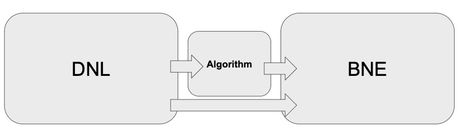

BNE
=========

Once a DNL representation of the SNL is established, the BNE allows to cache directives from DNL-based algorithms, which are purely computational. 
BNE apply these directives to the SNL in an optimized manner, focusing on eliminating redundant unification and enhancing usability for the user.

.. toctree::
   :maxdepth: 1

   classes/index.rst
