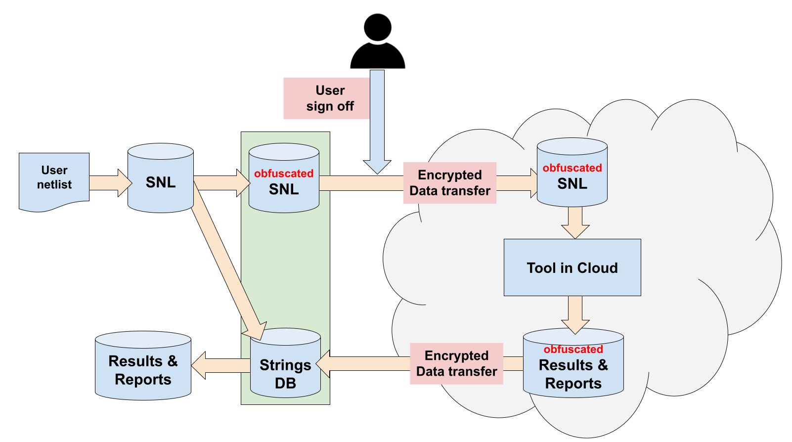

Cloud Distribution
------------------

Naja SNL and DNL have been designed to be deployed in a cloud environment.

SNL relies on the following aspects:

Unique identification
*********************
SNL objects are identified not through string ids but though SNLID.
This allows to anonymize the netlist before transfer.
Depending on the needs of the operating tools and algorithms, it is also possible to
strip the netlist from sensible information (for instance, LUT masks in the context
of FPGA flow).

Data on disk clarity
********************
By relying on off-the-shelf technology Cap'n Proto, users can 
leverage Cap'n Proto API and tools to inspect their data and easily develop
sign-off tools independent of Naja that can assert the absence of sensible information before
transfering their data from on-premise to Cloud.

The following diagram shows the possible flow that can be used to transfer Naja data
structure from on-premise to Cloud under user's control.

