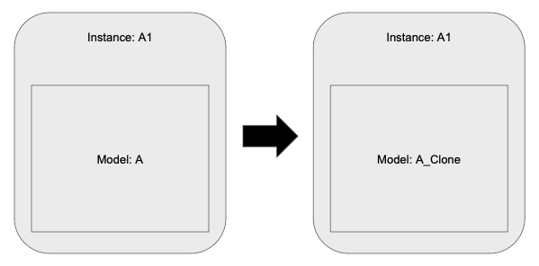

Clone API
=========

In an hierarchical netlist, there are models who are being used multiple times as implementation for different instances.

The action of uniquification of an instance means to create a unique model for the context of the instance alone by cloning its original model.

In order to implement the operations of the BNE(Batch Netlist Editor), we will have to be able to uniquify models as there will be times when we will want to edit a specific context without affecting the rest of the instances of the current model.

In order to enable uniquification in SNL, we are providing 2 APIs

   1) clone() API for SNLDesign.
   2) setModel(SNLModel* model) for SNLInstance. 

These 2 APIs are the atomic actions that together can implement Uniquification. 
