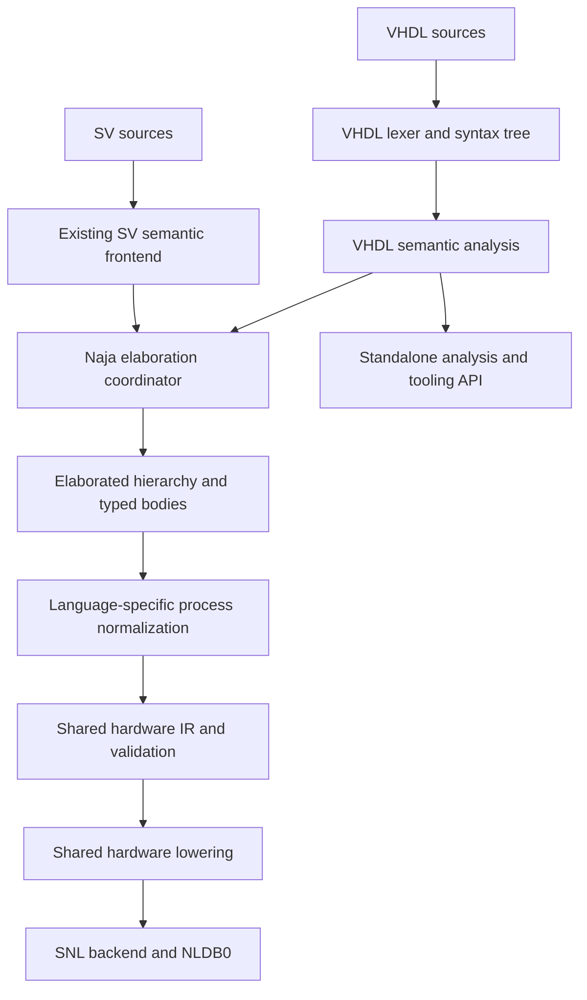

# VHDL frontend and shared HDL elaboration study

Status: architecture proposal, not an implementation commitment. Repository
baseline: `51461f00`. Research date: 2026-09-20.

Feasibility status: the [boundary contract](vhdl_frontend_contract.md),
[semantic probes](../src/vhdl/README.md), [corpus inventory](../src/vhdl/tests/corpus/manifest.json),
and [reuse experiment](../src/vhdl/tests/semantic/reuse/vhdl_lang_0.88.0.json)
record the first evidence. Shared mux/register construction is implemented.
Phase 0 is partially complete; native VHDL parsing and elaboration, a
pinned-revision notice audit before source redistribution, and contributor/API
decisions remain open. The corpus's repository-level licenses indicate no
blocker for reference validation or ephemeral test use; see the inventory's
rights review. The semantic probe
corpus has now been run with a second independent runtime simulator; see the
versioned NVC report alongside the GHDL baseline. Phase 1 has started with a
standalone C++20 lexer, bounded recursive-descent parser, and initial name
binding pass under `src/vhdl/`; design elaboration is not implemented yet.

## Recommendation

Develop a C++20 VHDL language library inside the Naja repository, with a
handwritten lexer and recursive-descent parser. Keep its syntax, semantic model,
diagnostics, and public interfaces independent of Naja and SNL from the first
milestone. In-tree development is temporary: extracting this library into its
own repository is a required deliverable, not an optional packaging choice.
Naja will own the elaboration workflow and the shared hardware construction
pipeline. Extract reusable services from the existing SystemVerilog frontend
incrementally, with both languages exercising each extracted service.

The long-term deliverable is an embeddable compiler frontend: source management,
recoverable parsing, semantic analysis, library management, hierarchy inspection,
diagnostics, and documented APIs. A parser alone does not meet that objective.
Standalone users must be able to analyze VHDL without loading a netlist database.
VHDL-specific services needed for elaboration belong to that independent library;
Naja owns their orchestration, shared SV/VHDL hardware lowering and SNL integration.
The independent repository must be useful to clients other than Naja.

Use VHDL-2008 as the initial language target, with a published, narrower RTL
support profile. Track 1993/2002 compatibility and later revisions separately;
do not advertise full revision support based on successful parsing. Treat mixed
SV/VHDL hierarchy as a subsequent milestone, not a prerequisite for the first
single-language frontend.

## Existing Naja boundaries

The knowledge graph was used for orientation, followed by source inspection.
The following are observations about the baseline, not proposed new APIs:

| Existing location | Observation and consequence |
| --- | --- |
| [SNLSVConstructor.cpp](../src/nl/formats/systemverilog/frontend/SNLSVConstructor.cpp) | `construct()` obtains an elaborated compilation root before `buildDesign()` creates SNL. Expression lowering, process analysis, primitive emission, diagnostics, and source tracking coexist in this implementation. There is no ready-made general HDL elaborator to plug VHDL into. |
| [SNLSVConstructor.h](../src/nl/formats/systemverilog/frontend/SNLSVConstructor.h) | Construction options and retained AST links are language-specific. Retained compiler state is owned through an NLDB property. Preserve this lifetime discipline while introducing neutral source/symbol handles. |
| [NLDB0.h](../src/nl/netlist/core/NLDB0.h) | Canonical gates, sequential elements, memory and arithmetic primitives already provide common hardware targets. Reuse their identities and reconstruction rules. |
| [SNLDesignModeling.h](../src/nl/netlist/decorators/SNLDesignModeling.h) | Timing and sequential model metadata provide shared primitive semantics. New primitives must remain aligned with C++ and Python loaders. |
| [SNLRTLInfos.h](../src/nl/netlist/snl/SNLRTLInfos.h) and [SNLSVIntent.h](../src/nl/formats/systemverilog/frontend/SNLSVIntent.h) | There is existing source/RTL metadata and language-specific intent inspection. Preserve source relationships without making the VHDL API inherit SV type assumptions. |
| [SV frontend tests](../test/nl/formats/systemverilog/frontend/CMakeLists.txt) | Existing elaboration, combinational, sequential overlap, memory, and intent tests are regression gates for extraction. |

For example, `createDFFInstance()` already performs generally useful primitive
construction, but also accepts frontend-specific source ranges and symbols and
reads active lowering state. Extraction requires explicit inputs and ownership,
not simply moving that function to another file.

## Architecture and meaning of elaboration

Separate three responsibilities:

1. **Language analysis:** declarations, scopes, overload resolution, types,
   constraints, legality, and static expression semantics.
2. **Design elaboration:** top selection, generic/parameter specialization,
   binding, generate expansion, instance hierarchy, and concrete object shapes.
3. **Hardware lowering:** convert supported process semantics and expressions
   into dataflow, next-state functions, storage, and finally SNL primitives.

Elaboration runs in Naja, using language services in-process. The common
elaboration engine owns traversal, specialization caches, dependency scheduling,
resource limits, and the instance graph. VHDL services determine VHDL binding,
staticness, constraints, and generic evaluation. SV services retain their
existing semantic implementation during migration. Moving all SV semantic
elaboration into a new engine is a separate, much larger project; it is not
necessary to share hardware lowering or the orchestration API.



The SV adapter initially imports an already elaborated hierarchy; the VHDL
adapter participates in specialization directly. This asymmetry is intentional
and must be visible in the API. A future mixed-language resolver will require
callbacks across language boundaries; importing two complete hierarchies alone
will not implement mixed-language elaboration.

### Share machinery where semantics have been made explicit

| Area | Shared machinery | Language-specific responsibility |
| --- | --- | --- |
| Source and diagnostics | File buffers, ranges, diagnostic records, rendering, provenance | Lexical conventions and diagnostic rules |
| Constants | Arbitrary precision storage, resource accounting, memoization | VHDL universal values, enumeration/physical values, staticness, range checks, operator meaning |
| Hierarchy | Instance graph, dependency traversal, specialization cache | Architecture/configuration selection, library visibility, generic/parameter legality |
| Expressions | Typed dataflow nodes, explicit conversions, hardware builders | Overload resolution, result bounds, sizing, signedness and conversion insertion |
| Processes | Guards, control flow utilities, next-state merging, storage emission | Signal/variable semantics, scheduling and legal clock templates |
| Backend | Gates, muxes, registers, memories, connectivity checks, source attachment | Language adapters supply fully specified operations |

Measure reuse by common passes actually used by both languages and shared bug
fixes, not a target percentage of source lines. Do not force a universal syntax
tree or a universal overload resolver merely to increase that percentage.

### Intermediate representation contract

Introduce a small typed hardware IR, growing it only with tested consumers.
It sits after language-specific name/type analysis and process normalization,
before SNL mutation. Keep the richer VHDL semantic tree available for tooling.

The initial IR needs explicit widths, signedness, constants, bit ordering,
extract/insert/concatenate, conversions, arithmetic, comparisons, muxes,
connections, instances, and register next-state descriptions. Registers carry
clock edge, enable, reset polarity/value/priority, and initialization metadata.
Later additions include latches and memory ports with read/write behavior.

Maintain source shapes alongside flattened values: bounds, direction, null
ranges, record fields, and the mapping between source indices and hardware bits.
Do not mistake VHDL array direction for arithmetic signedness. A semantic type
identifier must retain declared type identity even when two values share a
hardware representation.

Keep nine-valued logic in VHDL analysis and constant evaluation. SNL nets are
currently two-state; the supported hardware profile must therefore state its
binary-domain assumptions. Dynamic logic values requiring resolution, strengths,
or observable unknown-state behavior cannot be silently collapsed. Reject them
until represented faithfully or covered by an explicitly selected, documented
synthesis policy. Initialization metadata is a separate capability, not proof of
multi-valued net support.

Each IR node has stable provenance handles; each pass either consumes a construct
or reports it as unsupported. Validation precedes backend publication. Build
into staging state and publish only a complete successful design; establish the
exact rollback mechanism during the first backend extraction.

## Frontend library design

Use a handwritten scanner, recursive descent for declarations/statements, and
precedence-based expression parsing constrained by the VHDL grammar. Introduce
no Flex, Bison, or Yacc build dependency for this frontend. Small generators for
token tables, visitors, or diagnostic identifiers are acceptable if their output
is deterministic and the parser remains directly understandable.

The lexer must handle case-insensitive basic identifiers while preserving source
spelling, case-sensitive extended identifiers, character literals versus
attribute apostrophes, based literals, bit-string literals, comments, and
revision-dependent keywords. Parsing must preserve ambiguous name/application
forms until semantic analysis can distinguish indexing, slicing, conversion,
and function calls.

Store tokens, trivia, and source spans in an immutable syntax tree with explicit
missing/error nodes. Recover at declaration and statement boundaries with a
bounded token budget and guaranteed forward progress. Recovery enables editor
use but never authorizes elaborating erroneous syntax. Fuzz malformed input and
deep nesting from the first parser milestone.

Keep syntax and semantic objects separate. Semantic analysis requires scopes,
visibility, declaration identity, overload candidate sets, expected-type
propagation, deferred constants, package declarations/bodies, and subtype
constraints. Implement constant function evaluation under recursion/step/memory
limits. Cache keys include revision, library identity, dependencies, generic
values/types, and relevant compilation options.

VHDL design libraries are first-class inputs. `work` denotes the current working
library, not a process-global literal library name. Model dependencies between
design units, invalidate dependent analysis on changes, and diagnose missing or
ambiguous bindings. The MVP can require an explicit source order; automatic
ordering must handle declaration/body dependencies rather than sorting filenames.

Analyze the selected standard packages as real declarations. Recognize hardware
intrinsics through resolved declaration identity and supported signatures, never
through text such as an unqualified `rising_edge` or `resize` alone. Pin package
sources and record provenance and redistribution notices. Type-check package
interfaces even when a validated intrinsic implements their operation.

### Packaging and API boundaries

Target layout; `src/vhdl/` currently contains the semantic probes, and
`src/nl/formats/hdl/` contains the first shared primitive builders:

| Location | Responsibility |
| --- | --- |
| `src/vhdl/` | Self-contained future repository root, with its own public headers, sources, tests, documentation and build entry point |
| `src/vhdl/support/` | Frontend-owned source buffers, diagnostics and neutral identifiers; extracted with the library |
| `src/hdl/elaboration/` | Common orchestration, hierarchy, specialization infrastructure |
| `src/hdl/ir/` | Typed hardware representation and independent validation |
| `src/nl/formats/hdl/` | Shared SNL lowering/backend |
| `src/nl/formats/vhdl/` | VHDL-to-Naja integration and constructor |

Dependency direction is from Naja integration toward frontend libraries. Public
frontend headers must not include SNL, Python bindings, netlist serialization,
or SV compiler types. Independence applies to implementation files, tests and
build scripts as well as public headers: the library must not link any Naja
target or depend on Naja's source tree, generated headers or runtime. Its own
namespace and public object model must not require Naja classes. Neutral external
dependencies are acceptable when explicitly declared and independently available.

The eventual public API should expose sessions, source loading, parsing,
analysis, symbol/type queries, diagnostics and visitors. Elaborated hierarchy
inspection is an optional module. Make ownership, thread safety and handle
invalidation explicit. Start with a C++ API; defer stable binary ABI and a C ABI
until real external consumers establish requirements. Keep any AST JSON format
versioned and distinct from the supported in-process API.

Initially build all components in-tree with CMake. From Phase 1, CI must copy or
export only the future repository root into an isolated directory, configure it
without the parent project, run its tests, install its exported CMake package,
and compile a separate consumer. This catches dependencies hidden by the Naja
superbuild. Maintain Bazel smoke coverage once targets exist. Keep development
APIs explicitly unstable until that consumer is proven.

The extraction boundary is explicit: lexer, parser, syntax/semantic trees, type
checking, constant evaluation, VHDL library/binding services, diagnostics,
frontend support code, and their tests/documentation move together. Naja's
elaboration coordinator, shared hardware IR/lowering, SNL backend, and Naja
CLI/Python integration remain in Naja. Translate frontend objects into Naja IR
inside the Naja adapter; the frontend does not depend on that IR. Any utility
needed on both sides must be frontend-owned or an independent dependency, never
a reverse dependency on Naja.

After extraction, Naja consumes a pinned release/commit of the external library,
with CMake and Bazel dependency pins kept in sync. Integration tests remain in
Naja; language conformance and standalone API tests live with the frontend.
The external repository owns its releases, CI, documentation and issue tracking.
There must be one maintained implementation, not an external copy that drifts
from an in-tree version. Extraction does not wait for complete VHDL coverage or
mixed-language elaboration.

Future Python loading/configuration belongs in both the raw bindings and the
high-level package where appropriate, with the corresponding API documentation.
No Python API change is proposed by this study itself.

## Semantic traps that must drive the design

**Signals and variables.** In a clocked process, `s <= d; q <= s;` reads the old
signal `s` for `q`, while `v := d; q <= v;` observes the updated variable. Maintain
distinct environments for immediate variable updates, current signal reads, and
scheduled signal updates. Partial writes and branch priority must be normalized
before common next-state merging. Variables can also retain state across process
activations; they are not invariably temporary wires.

**Process activation.** Sensitivity lists, `process(all)`, event attributes and
wait statements affect execution. Initially accept a documented combinational
profile and recognized edge-triggered processes. Diagnose incomplete sensitivity
lists under the strict profile rather than silently changing simulation behavior.
Reject unsupported waits, delayed waveforms, transport/inertial timing, and
feedback requiring delta-cycle execution. A general event simulator is outside
the initial deliverable.

**Arrays and arithmetic.** Ascending, descending, nonzero-based, unconstrained
and null arrays must preserve positional association and index mappings.
Overloaded numeric operations determine result widths and bounds; assignment
does not inherit SV truncation/extension rules. Cover negative operands,
division, `mod` versus `rem`, shifts, bounds checks, and integer range overflow
before claiming those operations supported.

**Drivers and binding.** Diagnose illegal multiple drivers on unresolved signals.
Resolved multi-driver signals need a real resolution implementation or rejection.
Do not infer missing entity/component interfaces as permissive blackboxes.
Provide explicit blackbox declarations with validated ports. Architecture
selection must be reproducible; require an explicit selection when the supported
binding policy cannot resolve it unambiguously.

**Initialization.** Signal and variable initial values may affect observed
behavior before reset. Preserve supported initialization using existing primitive
metadata or reject it with a precise diagnostic. Do not drop it on the assumption
that reset always occurs.

## Feature progression

Maintain separate columns for parsed, analyzed, elaborated and lowered in the
eventual conformance matrix. Every feature outside the selected profile gets a
specific diagnostic, including features accepted for standalone analysis.

| Stage | Intended positive support | Explicit boundaries |
| --- | --- | --- |
| Vertical proof | Entities/architectures, explicitly selected top, scalar and constrained vector ports, constants, simple concurrent expressions, one edge-triggered process | Narrow declared type/operator set; no implicit claim to general VHDL support |
| Useful RTL alpha | Integer generics, hierarchy, direct entity instantiation, static generate/loops, packages, constrained integer/enum/array/record types, selected `std_logic_1164` and `numeric_std` operations, combinational and reset/enable clocked processes | Single-driver binary hardware profile; reject unsupported timing, resolution and binding |
| RTL expansion | Component/configuration binding, unconstrained interfaces, richer functions/aggregates, memory inference, generic packages as separately gated features | Every expansion requires semantic and backend tests; no catch-all fallback |
| Tooling and interoperability | Broader syntax/analysis, standalone clients, mixed-language binding | Simulation-only constructs may be analyzable without hardware lowering |

The complete alpha feature list must follow a real corpus inventory. Records,
packages and overload resolution are important practical requirements, but should
not all be prerequisites for the first end-to-end proof.

## Existing VHDL implementations: evidence and options

These sources inform alternatives and validation. GHDL was used for semantic
probes and small, medium and large RTL corpus samples. The VHDL-LS command-line
release was used for a bounded static-analysis comparison; no external
implementation was integrated or benchmarked for throughput.

| Option | Evidence | Assessment for this project |
| --- | --- | --- |
| Native C++ library | Fits the repository's C++20 build and the proposed public API | Recommended working hypothesis; largest semantic implementation effort, best control over common Naja elaboration |
| GHDL integration | Its documented architecture includes reusable components through `libghdl`; its synthesis frontend can produce netlists | Evaluate as a differential reference and an optional import path. Importing a completed netlist does not provide the requested shared elaboration architecture. Direct reuse needs an API, dependency and license assessment. |
| VHDL-LS analysis library | Rust frontend separates parsing and semantic analysis and supports tooling-oriented diagnostics | Version 0.88.0 accepted/rejected the 35 probe sources at the expected analysis stage. Its public crate is Rust and supplies no C ABI or hardware-lowering interface; an FFI or process boundary and further specialization/API study would be required. Static agreement does not establish runtime behavior or suitability as the standalone C++ library. |
| NVC | VHDL compiler/simulator with separate analysis/elaboration/execution; explicitly not a synthesizer | Independent runtime comparison completed for all 35 semantic probes with NVC 1.23.0. See `src/vhdl/tests/semantic/reference_nvc_1.23.0.json`; 32 cases matched the GHDL harness stage and diagnostic rules exactly, and three showed diagnostic wording or detection-stage differences while still rejecting the intended invalid constructs. |

Primary sources: [GHDL architecture](https://ghdl.github.io/ghdl/internals/index.html),
[GHDL synthesis](https://ghdl.github.io/ghdl/using/Synthesis.html),
[VHDL-LS project](https://github.com/VHDL-LS/rust_hdl), and
[NVC project](https://github.com/nickg/nvc).

Repository notices inspected: GHDL's
[GPL version 2 text](https://github.com/ghdl/ghdl/blob/master/COPYING.md),
VHDL-LS's [MPL-2.0 notice](https://github.com/VHDL-LS/rust_hdl/blob/master/LICENSE.txt),
and NVC's GPL-3.0-or-later declaration in its project documentation. These are
dependency-selection inputs, not a conclusion about every file or integration
mode. Before adopting source, review the actual pinned files and package notices.
For new native code, propose Apache-2.0 consistent with Naja's source headers.

The language reference is
[IEEE 1076-2019](https://standards.ieee.org/ieee/1076/5179/), with the relevant
revision's clauses governing each supported mode. This study has not performed
a clause-by-clause standards audit. Compiler agreement is evidence, not the
definition of language semantics. The current reference pins the VHDL-2008
`std_logic_1164` and `numeric_std` source files used by probes; selecting the
supported package subset and policy for redistribution remain open.

## Work plan and acceptance gates

The next step is a bounded feasibility phase, followed by implementation only as
each architecture assumption is demonstrated. Effort below is a planning estimate
for an engineer familiar with compiler and HDL semantics, not a delivery promise.

### Phase 0: feasibility and decisions — approximately 2–4 engineer-weeks

- Select representative small, medium and large RTL projects with usable test
  rights; inventory revisions, packages, configurations and vendor dependencies.
- Pin reference-tool versions and standard packages. Create a matrix of roughly
  30–50 semantic probes covering overloads, bounds, scheduling and binding.
- Specify the minimal typed IR and adapter contract, including value domain,
  provenance, specialization identity and failure handling.
- Prototype the dependency boundary around one mux or arithmetic builder and one
  register builder, retaining the existing SV path as the regression baseline.
- Compare VHDL-LS static-analysis disposition on the same 35 probes and record
  API/build boundaries; defer diagnostic-quality and throughput conclusions.
- Record repository-level corpus licenses and notice conditions; define the
  binary hardware profile and any explicit treatment of non-binary constructs.
  Check exact pinned-file notices before redistribution.

Exit: the current artifacts establish a provisional native C++ direction, a
narrow shared-construction boundary, successful GHDL analysis/hierarchy checks
for small, medium and large RTL samples, a second runtime oracle, and a
repository-level review of corpus licenses for reference/test use. Phase 0
now has a preliminary corpus-based binary-profile review, but remains open
until its policy for non-binary constructs, contributor capacity, and the
first public API are agreed. Check exact pinned-file notices before
redistributing source.
Standard-package source hashes and notices are recorded in the reference
manifest. The proposed
initial hardware domain is binary: permit single-source `std_logic` signals as
binary hardware values, but reject multiple drivers and behavior that depends
on `U`, `X`, `Z`, weak values or resolution. The preliminary profile review is
recorded in the corpus manifest. GHDL synthesis completed for the UART, RPU and
NEORV32 selected tops. The UART and RPU source scopes showed no explicit
non-binary scalar logic literals in the reviewed scan. NEORV32 contains
explicit undefined `X` results, don't-care `-` assignments, and weak `L`/`H`
input defaults. Its use of `std_ulogic` prevents resolved multi-driver nets
but does not make the type binary. Therefore this corpus does not support a
claim that all three designs fit a strict binary profile. The initial frontend
should preserve nine-valued VHDL semantics through analysis and reject
unsupported non-binary hardware behavior, unless and until a deliberate
synthesis policy defines which constructs may be treated as don't-cares and
under what conditions. These source scans and synthesis runs do not establish
full driver counts, reachability, observability, or equivalence.

### Phase 1: vertical proof

Build the frontend-only target, source/diagnostic infrastructure, minimal parser
and analyzer. The parser now preserves conditional signal assignments and the
analyzer resolves names in their conditions. A narrow Naja adapter lowers one
single-bit conditional assignment over `bit` ports into the shared mux builder;
tests confirm its SNL wiring and that an equivalent SV design uses the same
canonical mux model. The adapter rejects `std_logic` and unsupported port or
assignment shapes before design creation. This is a lowering proof, not general
VHDL type analysis. A scalar clocked-register path is now implemented (see below). Extend the proof
to type-checked scalar expressions, ascending and descending vectors, a small hierarchy, and the
signal-versus-variable example above.

Exit: expected connectivity and cycle behavior agree; unsupported constructs
fail with source locations; malformed input terminates; failed loads publish no
partial design. A separate frontend client parses/analyzes without SNL linkage.

### Phase 2: practical RTL alpha

Add library/package semantics, numeric operations, generic specialization,
generate expansion and the chosen process profile. Introduce new shared lowering
passes only alongside SV regression coverage. Add Naja CLI/Python integration,
documented options, feature matrix and deterministic diagnostics.

Exit: selected real designs elaborate without silent omissions, representative
behavioral comparisons pass, initialization is preserved, snapshot round trips
work, and unsupported corpus features are individually reported.

### Phase 3: consolidation and broader reuse

Expand arrays/records/functions and binding according to corpus demand; add memory
inference with explicit read-during-write semantics. Move more SV hardware lowering
onto shared passes without replacing its semantic frontend wholesale. Validate
the configured behavior under negative tests and resource limits.

Exit: both languages demonstrably exercise shared lowering for the claimed
feature set; performance and peak memory are measured against fixed baselines;
there is no unexplained SV correctness or performance regression.

### Required extraction milestone: after Phase 2, or earlier once ready

Move the self-contained VHDL library into its own repository, preserving history
where practical. Publish its build/install instructions and external-consumer
examples; define release/version policy and source API guarantees. Replace the
temporary in-tree implementation with a pinned dependency and keep the Naja
adapter in this repository. This milestone can precede the RTL alpha if the
dependency boundary is already proven; Phase 3 expansion should use the external
repository.

Exit: a clean checkout of the frontend builds, tests and installs without any
Naja checkout; a separate client analyzes VHDL using only its documented API;
Naja builds against the pinned external dependency and passes its integration
tests. No duplicated frontend implementation remains in Naja. Record and verify
the corresponding CMake/Bazel pins.

### Phase 4: mixed-language work and broader standalone APIs

Treat mixed-language elaboration as a distinct workstream: explicitly define
library lookup, identifier casing, generic/parameter conversion, port direction,
array mapping, logic-value conversion, bidirectional ports and recursive binding.
Reject ambiguous or unsupported boundaries. A flat netlist merger is insufficient.

Exit: an external analysis client and an external hierarchy consumer work through
documented APIs; supported mixed-language examples bind deterministically and have
behavioral checks. Full language coverage and simulation remain separately scoped.

## Verification and risk management

Use lexer/parser fixtures and fuzzing; semantic positive and negative cases;
elaboration hierarchy/type checks; IR invariants; and SNL connectivity checks.
For small combinational designs, use exhaustive truth tables. For sequential
designs, compare reset, enable, initialization and several-cycle behavior with
independent simulation. Add formal equivalence where the common supported model
allows it. Netlist text equality is not a semantic test.

Use GHDL and NVC as separately installed reference tools, with pinned versions,
options and reproducible inputs. Investigate disagreement against the relevant
language rules. Use synthesized-netlist comparisons only within their supported
profiles. Explicitly test analysis failures and expected unsupported diagnostics;
a suite of successful examples cannot detect silently ignored constructs.

During shared-code extraction, run the existing SV constructor suites and focused
NLDB0, serialization and intent tests. Changes to Python APIs require raw and
high-level documentation and a Sphinx build. New primitive timing capabilities
require matching C++/Python modeling tests. CMake remains the primary validation
path; Bazel smoke and dependency-pin checks apply when targets/dependencies change.

Record parse, analysis, elaboration and lowering times independently, plus peak
memory, specialization counts and emitted primitive counts. Establish thresholds
from the selected corpus rather than inventing throughput claims. Include repeated
loads and teardown to detect stale handles and retained AST memory.

The largest risks are semantic completeness, standard-package evaluation,
two-state backend assumptions, accidental SV coupling, and an overlarge initial
feature set. Address them with the explicit profiles, neutral interfaces, semantic
probes and phased gates above. A usable RTL frontend is a substantial compiler
project; standalone maturity and broad language compatibility require sustained
work beyond a parser prototype.

## Decisions still to settle

The working defaults are C++20, handwritten parsing, VHDL-2008 RTL first,
strict rejection of unsupported hardware semantics, and an independently
buildable library temporarily hosted within the repository, followed by mandatory
extraction into its own repository. Phase 0 must settle the first real
design corpus, precise package/revision profile, reuse experiment outcome,
binary-domain policy, contributor capacity, and scope of the first public API.
None of these requires rewriting the current SV semantic engine before VHDL
development begins.

## Scalar clocked-register proof

The Phase 1 adapter also accepts one event-guarded process over scalar `bit`
ports:

```vhdl
process(clk) begin
  if clk'event and clk = '1' then q <= d; end if;
end process;
```

The sensitivity, event and level names must resolve to the same input port;
`d` must be an input and `q` an output. Basic names are case insensitive.
The parser retains these names and source spans, and the standalone analyzer
checks their declarations. The adapter validates the binary type, port modes
and process shape before creating a design, then calls the shared
`SNLRTLPrimitives::createDFF()` positive-edge builder. Tests compare clock/data/
output wiring with the canonical DFF also used by equivalent SystemVerilog.

This deliberately restricted template does not support reset, enable, falling
edges, variables, multiple writes, initialization, delays, vector registers or
function calls (including `rising_edge`). Unsupported forms are diagnosed;
edge functions await declaration/signature resolution. This is a connectivity
proof, not general process analysis or completed Phase 1 cycle validation.

Validation (2026-09-21): all 19 focused parser, analyzer and Naja adapter tests
passed in `build-vhdl-feasibility`; all 15 standalone frontend tests passed
from a temporary copy of `src/vhdl`. The local LLVM 23.1.1 build required
`-DCMAKE_CXX_SCAN_FOR_MODULES=OFF` to bypass a stale cached LLVM 23.1.0 scanner
path. The adapter suite includes equivalent SV mux/register checks and rejects
unsupported clock/process/type/initialization forms without publishing a design.
